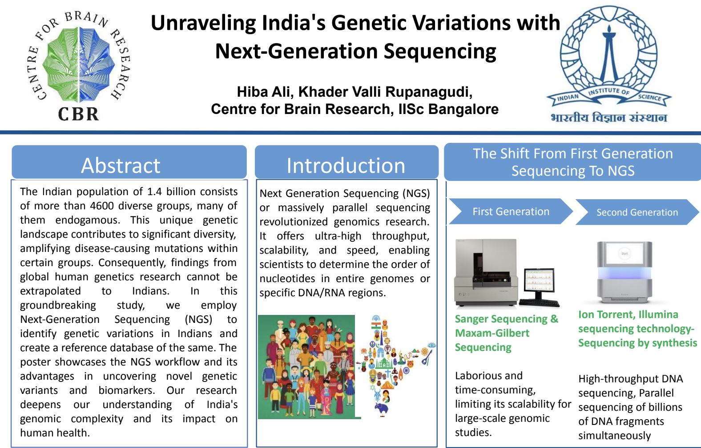

---
layout:single
permalink: /
title: "About me"
author_profile: true
redirect_from: 
  - /about/
  - /about.html
---

I am a researcher in **neurogenomics** with a strong interest in the genetic architecture of neurological and neuropsychiatric disorders. I currently work at the Centre for Brain Research, Indian Institute of Science (IISc), where I am leading the analyses for India's largest whole-genome sequencing study on Parkinson’s disease, which aims to sequence 1000 PD cases all acroos the country. My work includes identifying novel pathogenic variants, and conducting rare variant burden tests, and performing meta-analyses with ieuropean cohorts. I am particularly interested in the role of non-coding regulatory regions in brain-related disorders and the integration of genetic, neuroimaging, and environmental data to better understand disease mechanisms.

My broader research interests lie at the intersection of:

- Rare variant analysis and burden testing  
- Structural variation and regulatory genomics  
- Population-specific disease risk  
- Interpretable machine learning for genomic data  

I am particularly interested in the role of non-coding regulatory regions in brain-related disorders and the integration of genetic, neuroimaging, and environmental data to better understand disease mechanisms.

# CBRAIN internship poster at Centre for Brain Research, IISC.
### Genome India Poster

